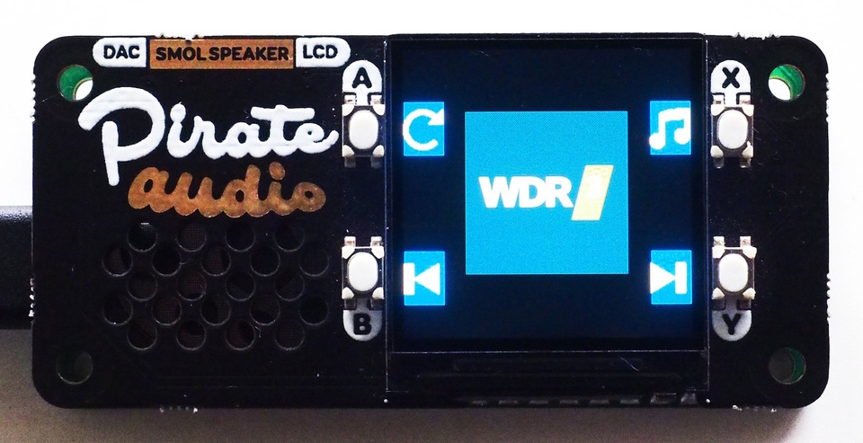

CircuitPython Webradio
======================

Overview
--------

This project implements a webradio player using CircuitPython
and a microcontroller. A webradio is a device that plays (endless) MP3-data
streamed from an URL.

Implemented functions:

  - navigate forward and backward through a list of URLs and play the
    given stream
  - display a station logo on a small display
  - restart a stream in case of problems
  - mute the stream (if supported by the DAC)
  - support additional buttons
  - highly customizable (alternative hardware only needs a few lines
    of glue-code)

Hardware Requirements
---------------------

This project requires

  - A microcontroller that has native WLAN and is fast enough for MP3-decoding.
    Tested chips are a Pico2-W and an ESP32-S3. Both support at least streams
    with a bitrate of cbr256.
  - An I2S-capable DAC-breakout, e.g. a cheap PCM5102A.
  - Four buttons for navigation.
  - A display for the station logo.

A Pico-W is fine for streams with a bitrate of cbr64, but many
stations don't stream their program with a lower bitrate than 128 anymore.

The last two items are not strictly required, but without navigation between
different streams and without the screen the gadget is a bit boring (but
good enough to play your single, favorite stream).

Usage is simple: the navigation buttons allow you to skip to the next
or previous station in the list. The reload button restarts a
stream. This is sometimes necessary if the decoder does not lock into
the downloaded stream correctly. The mute button toggles between mute
and unmute. The latter feature requires a mute-pin on the DAC, which
exists on most DAC breakouts.

Some example setups:

  - [Pico2-W with Pico-Zero-Base adapter and Pimoroni PirateAudio-Hat](doc/piraudio.md)
  - [Pico2-W with Waveshare Pico LCD-1.3 and PCM5102A](doc/pico2w_waveshare.md)
  - [ESP32-S3 with Pimoroni Display-Pack and Audio-Pack](doc/esp32s3_packs.md)
  - [Qt-Py ESP32S3 with EYESPI-BFF and Audio-BFF](doc/qtpy_esp32s3.md)

Software Requirements
---------------------

You need a current version of CircuitPython (9.2.3 or later is fine
for the ESP32-S3, the Pico2-W needs at least a 9.2.4 or later).

The application itself is distributed in the directory `src`. Copy all
files below `src` to your device (after creating suitable files for settings
and the hardware configuration, see below).

Also, this project provides a sample implementation for ST7789-based displays.
For other display-types, you need the relevant driver. Otherwise, you need

  - Adafruit_CircuitPython_Bitmap_Font
  - Adafruit_CircuitPython_ConnectionManager
  - Adafruit_CircuitPython_Display_Text
  - Adafruit_CircuitPython_Requests
  - Adafruit_CircuitPython_Ticks
  - Adafruit_CircuitPython_ST7789 (or a different driver)

Fonts
-----

This repository distributes a number of icons from the icon-font
provided by <https://www.appstudio.dev/app/OpenIconic.html>. To save
space, only a very small subset of the icons are included. See
[Preparing Icons](./doc/fonts.md) if you want to use other
icons or a totally different font.

Configuration
-------------

Settings must be provided in a file `src/settings.py`. This file contains
credentials, application settings and imports your specific hardware
configuration. See `src/settings_template.py` for a blueprint. Copy this
file to `src/settings.py` and adapt it for your needs.

Hardware-Configuration
----------------------

The settings-file from in the previous section imports the hardware
configuration file. The name of the file is not relevant, as long as
it creates an object called `hw_config` with a number of required
methods.  These methods return pins and other hardware-object to the
main-program.

This repository provides a number of example configurations for the
setups described above. Copy one of the files `src/hw_config_*.py` and
adapt it for your needs.

Stations
--------

Radio-stations (URLs) are defined in `src/stations.py`. This repo contains
a sample file with a number of European stations. Adapt this list to
your needs. It is a list of dicts with the following structure:

    channels = [
      { "name": "Station Name",
        "url":  "http://streaming.url/of/my/station",
        "logo": "logo-filename_without_path_and_extension"
      },
      ...
    ]

For every station, you can supply an individual logo. Usually, you
will find suitable images on the website of your radio station. Copy
this image and convert it to a BMP-file of a suitable size for your
display. Put the file in the folder `src/logos`. If you don't supply a
logo, the application will show a default image.

Note that not every station works. In the sample file is a French
station: it does start but fails after a few seconds. But usually
streams up to cbr256 play fine. If the station offers multiple URLs
with different bitrates, choose the lowest one with acceptable
quality. This also depends on your DAC and the headphones or speakers
you are using. Also, if possible, select an unencrypted stream, i.e.
an URL starting with "http:" instead of "https:".
