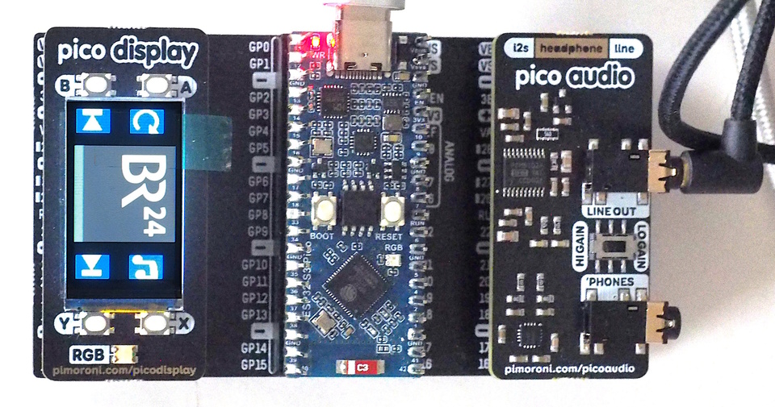

ESP32-S3 Pico with Display-Pack and Audio-Pack
==============================================

This setup uses a Waveshare ESP32-S3 Pico, which is pin-compatible to
normal Picos. In addition, the audio DAC is from Pimoroni (Pico Audio
Pack) and the display is also from Pimoroni (Pico Display Pack, first
version). It would also work with a normal Pico2-W or a Pimoroni
Pico Plus2 W.

Both packs plug directly into the Pico and block all pins, even those
that are not used. The setup above therefore uses a pin-multiplexer
(also from Pimoroni).

The Display Pack has a 240x135 ST7789-display and four buttons. The
Audio Pack has a line-out connector and a headphone jack. An
integrated amplifier provides two gain-levels for the latter.

Software support is in `src/hw_config_display_audio_pack.py`.
