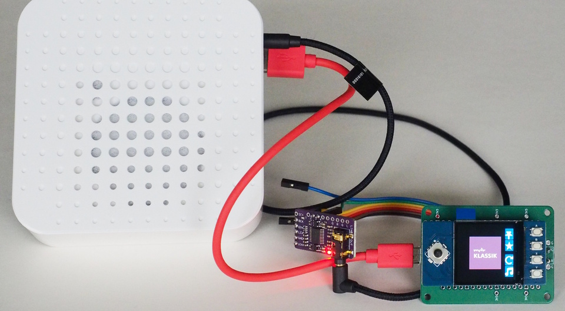

Waveshare Pico-LCD-1.3 with Pico2-W
===================================

The Pico-LCD-1.3 has a 240x240 ST7789-based display, a five-way
navigation button and four additional buttons. It plugs directly
into a Pico.

In addition to the display (and Pico2-W) the project needs an
I2S-breakout. This setup uses a cheap PCM5102A as a DAC. It does
not have an amplifier, but a stereo line-out plug.

An example configuration is available in
`src/hw_config_waveshare_13.py`. This configuration uses "left" and
"right" of the navigation button for switching channels and the lower
two extra buttons for reload and mute. The upper two buttons on the
right of the display are used for favorites.
