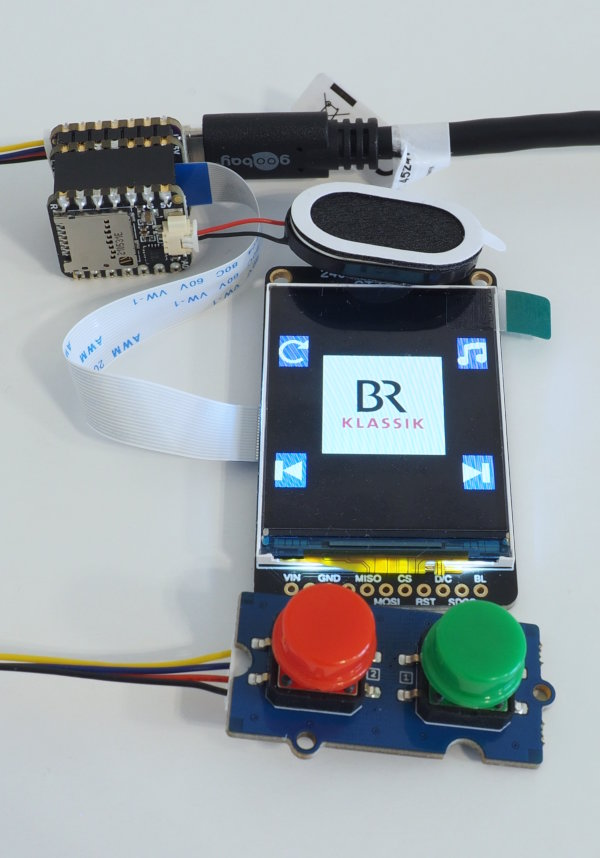

Adafruit Qt-Py ESP32S3 with EYESPI-BFF and Audio-BFF
====================================================

This minimalistic setup uses

  - a [Qt-Py ESP32-S3](https://adafru.it/5700)
  - an [EYESPI-BFF](https://adafru.it/5772)
  - an [240x320 ST7789-TFT with EYESPI](https://adafru.it/4311)
  - an [Audio-BFF](https://adafru.it/5769)
  - a [Mini Oval Speaker](https://adafru.it/3923)
  - a [Grove Dual Button Breakout](https://www.seeedstudio.com/Grove-Dual-Button-p-4529.html)

The two buttons of the breakout are connected to the I2C Stemma/Qt port, but
they are not I2C-based. These buttons are used for navigation.

The boot button next to the USB-C plug can also be used as an
application button. Pressing it will execute "reset".

There is no mute-button. The combination still has some unused pins, but the
Audio-BFF does not support a mute function.

Flash space is very limited on this device, so it does not support many
station logos.

Software support is in `src/hw_config_qtpy_esp32s3.py`.
